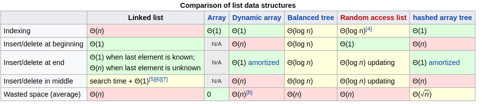
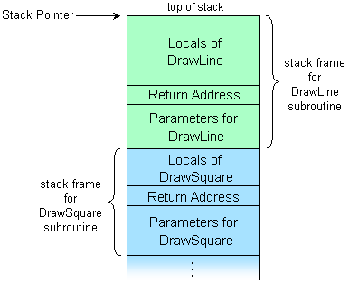

Datastructuren

---

Doel: organisatie data

---

Abstracte datatypes

---

>(...) an abstract data type (ADT) is a mathematical model for data types, where a data type is defined by its behavior (semantics) from the point of view of a user of the data, specifically in terms of possible values, possible operations on data of this type, and the behavior of these operations.

Bron: https://en.wikipedia.org/wiki/Abstract_data_type

---

- List
- Queue
- Stack
- Associative array

---

Datastructuren zijn _implementaties_ van ADTs

---

List

---

List implementaties:

- _Array_: blok geheugen alloceren, vaste grootte
- _Linked list_: dynamisch, kan groeien/kleiner worden

---

Linked list

---


---

```js
class Node {
  constructor(data) {
    this.data = data;
    this.next = null;
  }
}
```

---

```js
class SinglyLinkedList {
  constructor() {}
  append(data) {}
  insert(data) {}
  get(index) {}
  remove(index) {}
}
```

---


```js
//class SinglyLinkedList

  constructor() {
    this.first = null;
  }
```

---

```js
//class SinglyLinkedList

  append(data) {
    var newNode = new Node(data);
    if (!this.first) {
      this.first = newNode;
    } else {
      var current = this.first;
      while (current.next) {
        current = current.next
      }
      current.next = newNode;
    }
  }
```

---

```js
//class SinglyLinkedList

  insert(data) {
    var newNode = new Node(data);
    newNode.next = this.first;
    this.first = newNode;
  }
```

---

```js
//class SinglyLinkedList

  getNode(index) {
    if (index < 0 || index > this.length() - 1) {
      throw new Error("Index out of bounds.");
    }
    var current = this.first;
    for (var i = 0; i < index; i++) {
      current = current.next;
    }
    return current;
  }

  get(index) {
    return this.getNode(index).data;
  }

```

---


```js
//class SinglyLinkedList

  length() {
    var count = 0
    var current = this.first;
    while (current) {
      current = current.next;
      count++;
    }
    return count;
  }
```

---


```js
//class SinglyLinkedList

  remove(index) {
    if (index === 0) {
      var toRemove = this.getNode(index);
      this.first = toRemove.next;
    } else {
      var prev = this.getNode(index - 1);
      var toRemove = prev.next;
      prev.next = toRemove.next;
    }
    return toRemove.data;
  }
```

---

Complexiteit

---



---

Queue

---


---

```js

class Queue {
  constructor() {
    this.list = new SinglyLinkedList();
  }

  enqueue(data) {
    this.list.append(data);
  }

  dequeue() {
    return this.list.remove(0);
  }
}
```

---

Stack

---


---

```js

class Stack {
  constructor() {
    this.list = new SinglyLinkedList();
  }

  push(data) {
    this.list.insert(data);
  }

  pop() {
    return this.list.remove(0);
  }
}
```

---




---

Associative array

---

Hash table

---


---

Complexity

- Search: O(1)
- Insert: O(1)
- Delete: O(1)

---

Collisies

---


---

Collision resolution

- Separate chaining
- Open addressing:
    - linear/quadratic probing
    - double hashing

---

### Hash functies

```js
function crappyHash(value, size) {
  return value.length % size;
}


function betterHash(value, size) {
  var temp = 0;
  for (var i = 0; i < value.length; i++) {
    temp += value.charCodeAt(i) ** (i + 1);
  }
  return temp % size;
}
```

---

### Separate chaining

```js
class Entry {
  constructor(key, value) {
    this.key = key;
    this.value = value;
  }
}

class HashTable {
  constructor() { }
  set(key, value) { }
  get(key) { }
}
```

---

```js
//class HashTable

  constructor() {
    this.size = 11;
    // JS doesn't actually allocate array size though...
    this.buckets = new Array(this.size);
    // Init with empty lists
    for (var i = 0; i < this.buckets.length; i++) {
      this.buckets[i] = [];
    }
  }
```

---

```js
//class HashTable

  set(key, value) {
    var index = hashFunc(key, this.size);
    var entries = this.buckets[index];
    // Check if already added, if so, update the value
    for (var i = 0; i < entries.length; i++) {
      if (entries[i].key === key) {
        entries[i].value = value;
        return;
      }
    }
    // otherwise: create a new Entry
    var entry = new Entry(key, value);
    entries.push(entry);
  }
```

---

```js
//class HashTable

  get(key) {
    var index = hashFunc(key, this.size);
    var entries = this.buckets[index];
    for (var i = 0; i < entries.length; i++) {
      if (entries[i].key === key) {
        return entries[i].value;
      }
    }
    throw new Error("Unknown key.");
  }
```

---

DEMO TIME?

---
